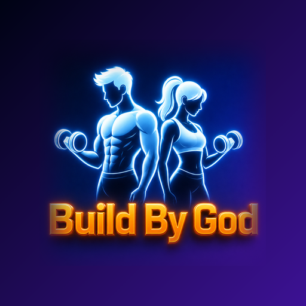

<!-- Banner -->
<p align="center">
  
</p>

<h1 align="center">
  
  &nbsp;Build By God
</h1>

<p align="center">
  <i>“Build By God” — powered by hemanth.</i><br/>
  A native Android <b>gym workout planner</b> with a full glossy dark UI.
</p>

<p align="center">
  
  
  
  
  
  
</p>

---

Plan your week, get reminders when it's time to train, follow guided workouts (warm-ups, exercises,
stretches), and browse a muscle-grouped exercise library with how-tos and demo videos.

> **No account, no login, no credentials** — everything is stored locally on your device.

## ⬇️ Download

A ready-to-install debug build lives in this repo:

```
apk/devel/BuildByGod-devel.apk
```

Copy it to an Android phone (Android 8.0 / API 26+), tap it, and allow installation from this source.

## ✨ Features

- **Glossy theme with full control** — light / dark / follow-system modes, six selectable accent
  color combinations (Aurora, Ocean, Sunset, Forest, Grape, Crimson), and a glass-intensity slider
  to dial the frosted look from translucent to solid. All applied live across the app.
- **Credential-free profile** — name, goal, units, reminder preferences (stored via DataStore).
- **Body metrics & nutrition** — store height, weight, age, sex, and activity level; the app computes
  BMR + TDEE (Mifflin-St Jeor), a goal-adjusted daily calorie target, protein/carb/fat macros, and a
  water target. Profile also shows workout count, streak, total minutes, and estimated calories burned.
- **Responsive & inset-aware** — edge-to-edge UI that works with both gesture and 3-button navigation,
  and centers content on tablets / large screens.
- **Weekly plan** — assign a workout to each day of the week, set a time, toggle reminders, mark rest days.
- **Time-based notifications** — exact weekly alarms remind you when it's time to train; tapping a
  reminder deep-links straight into that day's workout. Reminders survive reboots.
- **Home dashboard** — today's workout, a week strip, streaks, and totals at a glance.
- **Day detail** — split into Warm-up / Exercises / Stretches; add or remove moves per section.
- **Exercise library** — browse by muscle target, search, favorite, and open rich detail pages
  (step-by-step how-to, pro tips, a demo clip placeholder, and a "watch full video" YouTube link).
- **Guided session mode** — step through a day's workout with set targets and built-in timers for
  timed moves, then log it to your history.
- **Progress** — streak, weekly count, an 8-week activity heatmap, and recent session history.

## 🧱 Tech stack

- Kotlin + **Jetpack Compose** + Material 3 (custom glossy dark color scheme)
- MVVM + Repository pattern
- **Room** (exercises, plan, sessions) + **DataStore** (profile & settings)
- **Hilt** for dependency injection
- **Navigation-Compose**
- **AlarmManager** + boot receiver for reminders
- **Media3 / ExoPlayer** + Coil for demo media
- Min SDK 26, Target SDK 35

## 📁 Project structure

```
app/src/main/java/com/buildbygod/
  BuildByGodApp.kt          # Hilt app + notification channel
  MainActivity.kt           # Compose host + deep-link handling
  data/                     # Room entities, DAOs, DB, seed data, DataStore, repositories
  domain/model/             # Enums (MuscleGroup, ExerciseType, Goal, Units, ...)
  di/                       # Hilt modules
  notifications/            # ReminderScheduler, ReminderReceiver, BootReceiver
  ui/
    theme/                  # Colors, type, glossy components (GlassCard, GradientButton, ProgressRing)
    components/             # Background, top bar, exercise row, demo media
    navigation/             # Routes + bottom bar
    onboarding/ home/ plan/ daydetail/ library/ exercise/ session/ progress/ profile/

apk/
  devel/                    # debug APKs
  release/                  # signed release APKs (when built)
docs/                       # README banner + icon
```

## 🛠️ Building

The Gradle wrapper is checked in, so you can build without Android Studio.

**With Android Studio** (Koala or newer): open the `BuildByGod` folder, let it sync, then Run on an
emulator or device (API 26+).

**From the command line** (needs JDK 17 + Android SDK):

```bash
# point Gradle at your SDK
echo "sdk.dir=/path/to/Android/Sdk" > local.properties

# build the debug APK -> app/build/outputs/apk/debug/app-debug.apk
./gradlew :app:assembleDebug
```

## 🎬 Demo videos / clips

Each exercise stores an optional `clipAsset` and a `youtubeUrl`:

- `youtubeUrl` is seeded with a YouTube search link so "Watch full video" works out of the box.
- `clipAsset` is `null` by default and renders a glossy placeholder. To bundle real looping demos,
  drop files in `app/src/main/assets/clips/` (e.g. `pushup.mp4`) and set the matching `clipAsset`
  value in `data/local/SeedData.kt` (e.g. `clips/pushup.mp4`). They will then play inline via ExoPlayer.

## 🔔 Notifications

On API 33+ the app requests `POST_NOTIFICATIONS` (from the Profile screen). On API 31+ it will
fall back to inexact alarms if exact-alarm permission isn't granted. All reminders are rescheduled
after a reboot via `BootReceiver`.

## 📝 Notes

- All data is local; there is no backend and no analytics.
- First launch seeds a curated exercise library and a sensible 7-day starter plan, which you can
  fully customize.

## ⚖️ License

**Proprietary — All Rights Reserved.** Copyright © 2026 Hemanth Selam.

This project is **not** open source. No permission is granted to use, copy, modify, or distribute
the code or assets without the owner's prior written consent. See [LICENSE](LICENSE) for the full
terms. The repository is public for viewing/portfolio purposes only.

---

<p align="center">
  <b>Build By God</b> · powered by <a href="https://github.com/SelamHemanth">hemanth</a><br/>
  <sub>© 2026 Hemanth Selam · All Rights Reserved</sub>
</p>
